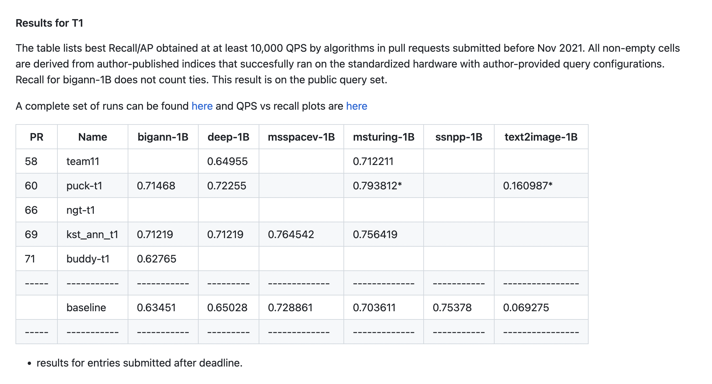
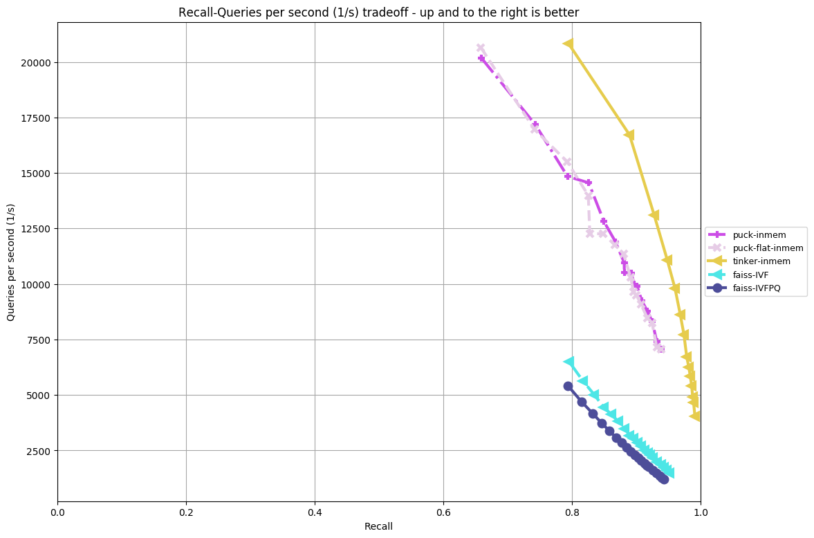
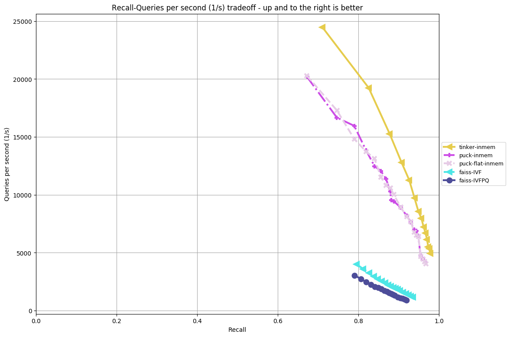
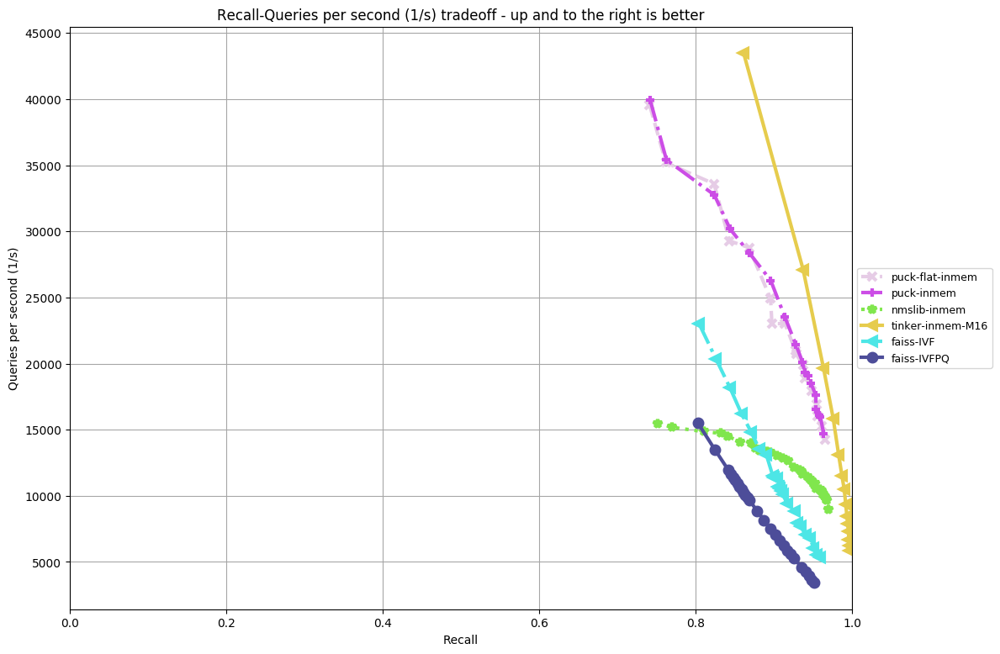
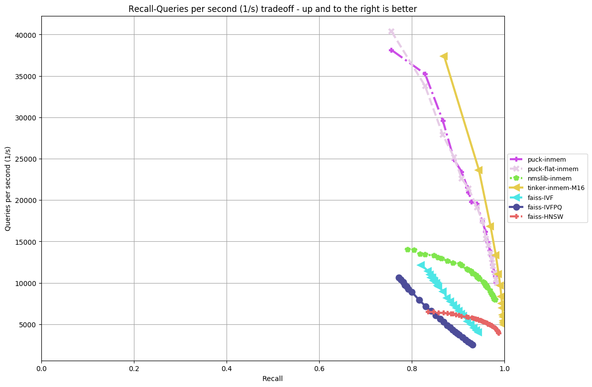

# 序言

&ensp;&ensp;&ensp;&ensp;在ANN检索领域，大规模相似搜索项目Faiss和ann-benchmarks等都对一些主流检索算法做过对比。本节分别使用千万、亿级、十亿级的公开数据集，对比Puck/Tinker与Faiss、Nmslib等开源框架在效果和性能上的差异。

&ensp;&ensp;&ensp;&ensp;Faiss是由Facebook AI Research研发，为稠密向量提供高效相似度搜索和类聚的框架，为目前业内应用最广的ANN框架。Faiss实现了多种检索算法，包括IndexFlat(暴力搜索)、IndexHNSWFlat、IndexHNSWPQ、IVFFlat、IVFPQ、IndexLSH和IndexPQ等。

&ensp;&ensp;&ensp;&ensp;相比与学术研究，在工业上更关注于召回率、单机吞吐、内存占用以及是否支持各种附加功能，比如实时插入、带tag的检索等。随着数据规模的不断增大，对检索算法提出了更高的要求。IndexFlat复杂度太高，并不适用于工业生产环境，IndexLSH适用于中小规模数据集，IndexIVFPQ是IndexPQ的一个加速版本，加速原理为：对原始特征空间进行分割为多个子空间，在检索过程中，快速锁定某几个子空间，在这些子空间内进行遍历。最终选取Faiss库中业内影响力较高的IVFFlat、IVFPQ和HNSWFlat与Puck进行对比。HNSW算法与上述算法不同，是一种全新的基于图结构的检索算法。当前业内有多个实现版本，根据[ann-benchmarks](https://ann-benchmarks.com/)对标结果显示，Nmslib版本性能最好，故把Nmslib版本也加入此次对标算法中。

# benchmark 详细介绍
&ensp;&ensp;&ensp;&ensp;为了能方便的支持公司内各种场景和算法的比对，我们以[Billion-Scale Approximate Nearest Neighbor Search Challenge: NeurIPS'21 competition track](https://big-ann-benchmarks.com/neurips21.html)的[big-ann-benchmarks](https://github.com/harsha-simhadri/big-ann-benchmarks)框架为基础，建立了自己的benchmark集合，除了10亿级数据，新增千万级（Bigann-10M、Deep-10M）和亿级别的标准公开数据集数据集（Bigann-100M、Deep-100M），对标了Faiss-IVF、Faiss-IVFPQ、Faiss-HNSW、Nmslib（HNSW）和Puck/Tinker算法。

&ensp;&ensp;&ensp;&ensp;支持自定义添加算法和数据集，欢迎添加更多的算法和数据集比对。

# 测试方法
&ensp;&ensp;&ensp;&ensp;在各类paper中，常见的对比指标是看时延和召回之间的曲线关系。但在具体实现中，时延可以通过多线程加速获得的提升，并不是一种公平比对的方式。同时，工业界大规模应用更看重的是吞吐，因此跟[big-ann-benchmarks](https://github.com/harsha-simhadri/big-ann-benchmarks)一样，我们选用相同吞吐下的召回率 / 相同召回率下的吞吐来做为基准指标。

# 运行环境
系统版本：CentOS release 6.3 (Final)

Docker version ：1.12.5

基于Docker运行，硬件限制如下：

- 检索CPU : 32核，检索内存：60G;
- 建库CPU : 系统CPU核数，建库内存：160G;

##### 注：Faiss建库过程中，会使用OMP并行加速且未指定并发个数，默认会使用系统CPU核数。其他算法与其打平，不限制建库并发度。Faiss检索过程中，倒排相关（IVF-*）算法中OMP并发度可通过设置omp_set_num_threads指定，Faiss-HNSW未指定并发个数需要在外部调度过程中控制并发度；Nmslib可通过传入indexThreadQty指定；Puck可通过修改gflags参数context_initial_pool_size的值指定。
 

# 对标数据集

### 一千万 & 一亿

&ensp;&ensp;&ensp;&ensp;2个一千万数据集：Deep-10M、Bigann-10M。2个一亿数据集：Deep-100M、Bigann-100M。

|   Dataset    | DataType  |  Dimensions | Distance  | Base data  | Query data  | top-K  |
| --------------- | ------------ | ------------ | ------------ | ------------ | ------------ | ------------ | 
|Deep-10M  | float32|96 |L2|10M|10K|100|
|Deep-100M  | float32|96 |L2|100M|10K|100|
|Bigann-10M  | uint8|128 |L2|10M|10K|100|
|Bigann-100M  | uint8|128 |L2|100M|10K|100|

### 十亿数据集

&ensp;&ensp;&ensp;&ensp;十亿数据集复用[NeurIPS'21 BIGANN大赛的数据集](https://big-ann-benchmarks.com/neurips21.html)。

|   Dataset    | DataType  |  Dimensions | Distance  | Range/k-NN |Base data | Sample data | Query data  |
| --------------- | ------------ | ------------ | ------------ |------------ | ------------ | ------------| ------------ |
|BIGANN | uint8 |128 |L2|k-NN|1B|100M| 10K|
|Facebook SimSearchNet++* | uint8 |256 |L2|Range|1B|NA| 100K|
|Microsoft Turing-ANNS* | float32 |100 |L2|k-NN|1B|NA| 100K|
|Microsoft SPACEV*| int8 |100 |L2|k-NN|1B|100M| 29.3K|
|Yandex DEEP| float32 |96 |L2|k-NN|1B|350M| 10K|
|Yandex Text-to-Image*| float32 |200 |inner-product|k-NN|1B|50M| 100K|

# 对标算法

### [Faiss](https://github.com/facebookresearch/faiss/wiki/Faiss-indexes)：

- Faiss-IVF：传统倒排。聚类中心个数 = sqrt（样本总数）* C，faiss推荐C取值10。
- Faiss-IVFPQ：传统倒排 + [PQ量化](https://lear.inrialpes.fr/pubs/2011/JDS11/jegou_searching_with_quantization.pdf)。对标使用1/4量化。
- Faiss-HNSW：HNSW算法。

### [Nmslib](https://github.com/nmslib/nmslib/tree/master/similarity_search)：

&ensp;&ensp;&ensp;&ensp;[HNSW算法](https://arxiv.org/abs/1603.09320)的作者推出的开源实现，目前实现HNSW方法最好的开源库。建库参数M，指定建库所构建图结构在第i（i>0）层的边的条数，第0层边的条数 = 2 * M，默认值16。建库参数efConstruction，构建图结构过程中，候选集的大小。通过选边策略，对候选集内节点进行筛选后构建无向图。检索参数efSearch，设置得越大，召回率越高，但同时查询的响应时间变长。

[Puck](https://github.com/baidu/puck)：

- Puck：百度内容技术部自研检索算法。默认使用1/4量化。

- Puck-flat：特指不量化的Puck，设置whether_pq=false，对标Faiss-IVF

[Tinker](https://github.com/baidu/puck)：

- Tinker：百度内容技术部自研检索算法

# 对标方法

&ensp;&ensp;&ensp;&ensp;Query数据集批量发起检索请求，迭代10次，记录最优检索耗时(ms)及对应的召回结果。每批次Query数据集检索过程中，检索处理并发度=32（镜像的CPU限制）。

&ensp;&ensp;&ensp;&ensp;ann-benchmark考量标准：

- QPS=1W时, 对应的Top100召回率，越高越好，

- 召回率在[0.8, 0.95)范围内，相同召回率下的QPS，越高越好

# 对标结果

## 十亿级别数据集

&ensp;&ensp;&ensp;&ensp;NeurlPS'21的[big-ann-benchmark](https://github.com/harsha-simhadri/big-ann-benchmarks/tree/main/neurips21)开源框架对所有参数算法进行测试后，产出[对标结果](https://github.com/harsha-simhadri/big-ann-benchmarks/tree/main/t1_t2)如下图。
该开源框架使用的base算法采用Faiss开源库，并对其进行优化，如引入OPQ、类Scann的分层索引结构等。

&ensp;&ensp;&ensp;&ensp;NeurlPS'21竞赛报告：https://arxiv.org/pdf/2205.03763.pdf。

#### 结论

&ensp;&ensp;&ensp;&ensp;在十亿级别超大规模数据集上，Puck在四个数据集上的性能均获第一。

## DEEP-100M

#### 统计数据

|   | Faiss-IVF  | Faiss-IVFPQ  |  Faiss-HNSW | Nmslib(HNSW)  | Puck  | Puck-Flat  | Tinker  |
| ------------ | ------------ | ------------ | ------------ | ------------ | ------------ | ------------ | ------------ |
| Build Params  | IVF100000,Flat  | IVF100000,PQ96  | HNSW32,Flat, "efConstruction" : 640  | "M": 32, "efConstruction": 640, "indexThreadQty":32  | "C":3000, "F":3000, "FN":16, "N":96  |  "C":3000, "F":3000, "FN":16, "N":0 | "C":3000, "F":3000,"tinker_neighborhood":16,"tinker_construction":600  |
| Index Size(G)  | 36.5807  | 9.72923  |   |   | 11.6738  | 38.1231  | 48.625  |
| Recall （QPS=1W）  | 0.724  |  0.675 | 60G检索内存超限  | 160G建库内存超限  | 0.893228  | 0.893212  | 0.947941  |
| QPS (Recall = 0.90)  | 2922  | 2185  |   |   | 9860  | 9607  | 15804  |

#### 召回率 & QPS：

#### 结论

&ensp;&ensp;&ensp;&ensp;对于亿级别数据集，内存成为HNSW的瓶颈。Faiss版本的HNSW在160G内存限制下，建库不受影响，但加载索引时，因内存超限导致加载失败。Nmslib版本的HNSW在建库时就遇到了内存超限的问题。
Tinker有着绝对的性能优势，内存低于Nmslib，高于Puck；当QPS=1W时候，召回率远高于其他算法；Recall=0.90时，吞吐达到了Puck的160%。Puck和Puck-Flat的性能高于除Tinker外的其他算法，内存上Puck有优势。

## BIGANN-100M

#### 统计数据

|   | Faiss-IVF  | Faiss-IVFPQ  |  Faiss-HNSW | Nmslib(HNSW)  | Puck  | Puck-Flat  | Tinker  |
| ------------ | ------------ | ------------ | ------------ | ------------ | ------------ | ------------ | ------------ |
| Build Params  | IVF100000,Flat  | IVF100000,PQ96  | HNSW32,Flat, "efConstruction" : 640  | "M": 32, "efConstruction": 640, "indexThreadQty":32  | "C":3000, "F":3000, "FN":16, "N":128  |  "C":3000, "F":3000, "FN":16, "N":0 | "C":3000, "F":3000,"tinker_neighborhood":10,"tinker_consstruction":600  |
| Index Size(G)  | 48.5399  | 12.726  |   |   | 14.6548  | 50.0447  | 56.077  |
| Recall （QPS=1W）  | 0.634  |  0.405214 | 60G检索内存超限  | 160G建库内存超限  | 0.881690  | 0.868196  | 0.926411  |
| QPS (Recall = 0.90)  | 1802  | 1156  |   |   | 9234  | 9347  | 13590  |

#### QPS & 召回率

#### 结论

&ensp;&ensp;&ensp;&ensp;与Deep-10M的性能表现基本一致，Tinker吞吐上优势明显；Puck性能仅次于Tinker，在内存上占优。

## DEEP-10M

#### 统计数据

|   | Faiss-IVF  | Faiss-IVFPQ  |  Faiss-HNSW | Nmslib(HNSW)  | Puck  | Puck-Flat  | Tinker  |
| ------------ | ------------ | ------------ | ------------ | ------------ | ------------ | ------------ | ------------ |
| Build Params  | IVF31622,Flat  | IVF31622,PQ96  | HNSW16,Flat, "efConstruction" : 640  | "M": 16, "efConstruction": 640, "indexThreadQty":32  | "C":1000, "F":1000, "FN":16, "N":96  |  "C":1000, "F":1000, "FN":16, "N":0 | "C":1000, "F":1000, "tinker_neighborhood":16,"tinker_consstruction":600  |
| Index Size(G)  | 3.6652  | 0.983101  | 4.92067  | 5.45275  | 1.18808 | 3.83257  | 5.01369  |
| Recall （QPS=1W）  | 0.858472  | 0.776675 | 采样QPS=1W的数据失败  | 0.961981  | 0.979596  | 0.981993  | 0.989963  |
| QPS (Recall = 0.95)  | 6174  | 3574  | 5623  | 10708  | 17772  | 17110  | 25204  |

#### QPS & 召回率

#### 结论

&ensp;&ensp;&ensp;&ensp;Tinker有着绝对的性能优势，内存高于Puck，低于Nmslib。当QPS=1W时候，召回率远高于其他算法。Recall=0.95时，Tinker吞吐是Puck的142%，是Nmslib的233%。Puck吞吐是Nmslib的164%。
Puck和Puck-Flat的QPS优于除Tinker外其他算法。
Faiss-IVF性能受数据集分布影响较大，在Deep-10M数据集上，召回率 <87%时，Faiss-IVF优于Nmslib，且性能优势较为明显。
相比Faiss-HNSW，Nmslib版本的HNSW在性能上优势更明显。

## BIGANN-10M

#### 统计数据

|   | Faiss-IVF  | Faiss-IVFPQ  |  Faiss-HNSW | Nmslib(HNSW)  | Puck  | Puck-Flat  | Tinker  |
| ------------ | ------------ | ------------ | ------------ | ------------ | ------------ | ------------ | ------------ |
| Build Params  | IVF100000,Flat  | IVF100000,PQ96  | HNSW32,Flat, "efConstruction" : 640  | "M": 32, "efConstruction": 640, "indexThreadQty":32  | "C":3000, "F":3000, "FN":16, "N":96  |  "C":3000, "F":3000, "FN":16, "N":0 | "C":3000, "F":3000,"tinker_neighborhood":16,"tinker_construction":600  |
| Index Size(G)  | 4.86123  | 1.28495  | 6.11273  | 6.64465  | 1.48694  | 5.02498  | 6.20208  |
| Recall （QPS=1W）  | 0.857864  | 0.776675 | 采样QPS=1W的数据失败  | 0.952535  | 0.979541  | 0.983525  | 0.987338  |
| QPS (Recall = 0.95)  | 3899  | 1661  | 5468  | 10034  | 17285  | 16259  | 22031  |

#### QPS & 召回率

#### 结论

&ensp;&ensp;&ensp;&ensp;Tinker有着绝对的性能优势，内存低于Nmslib，高于Puck。当QPS=1W时候，召回率远高于其他算法。Recall=0.95时，Tinker吞吐是puck的127%，是Nmslib的213%。Puck吞吐是Nmslib的167%。
Puck和Puck-Flat的QPS均优于Faiss和Nmslib，性能优势明显。数据分布对Puck影响相对较小，在两个数据集中，Puck性能表现稳定。
在Bigann-10M数据集上，召回率 >80%时，Faiss-IVF性能表现不如Nmslib。

## 总结

&ensp;&ensp;&ensp;&ensp;终上所述，Tinker有着绝对的性能优势，内存使用上大于Puck, 小于Nmslib；如果你的应用不是内存瓶颈，重点在计算上，请大胆使用Tinker；  当在大规模数据集上，内存成为瓶颈时，Puck具备了更多优势，表现远优于Faiss-IVF和Faiss-IVFPQ，随着数据规模越大，Puck优势越明显。

# benchmark实验复现方法

上述所有实验结果均可复现。

#### 1.安装python3.6，Docker环境

#### 2.Clone代码库到本地

    git clone https://github.com/baidu/puck 
    cd ann-benchmarks

#### 3.安装python依赖：

    pip install -r requirements.txt

#### 4.创建docker镜像（算法使用的开源库可查看对应的Dockerfile文件）：

    # Nmslib
    python3 install.py --algorithm nmslib_inmem 

    # faiss库镜像
    python3 install.py --algorithm faissconda 

    # Puck & Puck-Flat & Tinker
    python3 install.py --algorithm puck_inmem

#### 5.下载4个数据集：

    python3 create_dataset.py --dataset bigann-10M
    python3 create_dataset.py --dataset bigann-100M
    python3 create_dataset.py --dataset deep-10M
    python3 create_dataset.py --dataset deep-100M

#### 6.跑benchmark性能数据：
    # 每次执行一个数据集
    python3 run.py --dataset bigann-10M
    python3 run.py --dataset bigann-100M
    python3 run.py --dataset deep-10M
    python3 run.py --dataset deep-100M
    
#### 7.统计数据

    # Docker通常运行在ROOT下，需要修改一下输出结果文件的权限
    sudo chmod -R 777 results/

    # 输出Recall & QPS 拟合曲线图： 
    python3 plot.py --dataset bigann-10M --recompute
    python3 plot.py --dataset bigann-100M --recompute
    python3 plot.py --dataset deep-10M --recompute
    python3 plot.py --dataset deep-100M --recompute

    # 输出QPS=10000时的Recall：
    python3 data_export.py --output res.csv
    python3 eval/show_operating_points.py --algorithm faiss-IVF --threshold 10000 --csv res.csv
    

# 添加算法/数据集
欢迎各位同学添加自己的算法和数据集到benchmarks中，共同促进ANN的良性发展，协同共赢。
### 添加算法：
- 创建自己的Dockerfile文件。可参考install/Dockerfile.faissconda。
- 更新你的算法接口，继承BaseANN，可参考benchmark/algorithms/faiss_inmem.py
- 更新algos.yaml，配置你的算法训练、建库和检索参数。
### 添加数据集：
- 创建新数据集接口，继承DatasetCompetitionFormat
- 更新DATASETS

# 技术交流
QQ群（Puck技术交流群）：913964818

